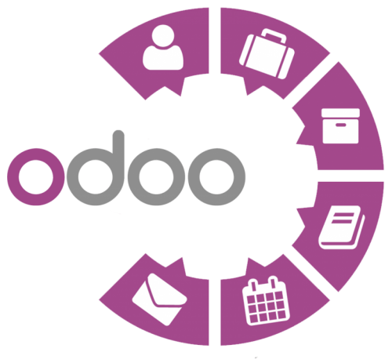

**Nabil L. A. - 1ºDAM**
***
# Trabajo de investigación sobre Odoo

## Índice

1. [¿Que es Odoo?](#¿qué-es-odoo)
2. [Historia](#historia)
3. [Módulo de operaciones](#módulo-de-operaciones)
4. [Módulo de ventas](#módulo-de-ventas)
5. [Módulos de sitio web](#módulos-de-sitios-web)

## ¿Qué es Odoo?

Odoo es un software de ERP integrado, es decir con una integración de de un isstema de planificación de recursos empresariales que ofrece una óptima forma de llevar acabo procesos empresariales, ofrece una gran integridad de datos así como facilidades para la eliminación tanto de datos como de información innecesaria, y permite compartir la información entre los usuarios de la organización que este utilizando el sistema.

Odoo tiene tanto una versión comunitaria de código abierto que se encuentra bajo la licencia LGPLv3 como otra versión empresarial (Odoo Enterprise Edition License v1.0) que tiene una licencia comercial desarrolladas ambas por la misma empresa,  Odoo S.A. (también conocida como OpenERP).

## Historia

En Bélgica durante el año 2005, Fabien Pinckaers, fundador y actual CEO de Odoo, comenzó el desarrollo de TinyERP con el objetivo de competir en el mercado de gestión empresarial, superando a grandes rivales como SAP. En 2006, adquirió el dominio SorrySAP.com, guardándolo para un momento oportuno. Tres años después de la obtención, cambiaron el nombre a OpenERP para aspirar a un estatus más grande.

Tanto el equipo y como el sistema crecieron gradualmente con el paso de los años y la consolidación del proyecto acabó dando frutos, llevando a la empresa de servicios en el momento a transformarse a editora de software en 2010, donde no lo solo establecieron departamentos de I+D y Ventas, si no que realizaron una expansión a nivel global con una red de socios.

Aunque 2011 fuera un año complicado debida a un incumplimiento del presupuesto de ventas, la empresa experimentó un crecimiento considerable que acabo desembocando en que dos años después, en 2013, con 2 millones de usuarios a nivel mundial, OpenERP se convirtió en el software de gestión más instalado. Llegando a incluso ser preferido por los analistas sobre SAP.

Tras el exito, en junio del siguiente año (2024), se lanzó al mercado la versión 8 con CMS, comercio electrónico, punto de venta, inteligencia empresarial y más de 3000 módulos extras, con la intención de reflejar la expansión más álla de las funciioones propias de un ERP. Dando lugar así al cambio de nombre a Odoo y a la conversión a una de las opciones líderes en gestión empresarial.

## Módulo de operaciones

Este abarca una serie de funcionalidades que forman el nucleo del diseño para facilitar la gestión integral de las operaciones comerciales de una empresa. Cabe destacar que, además, engloba diversas áreas clave de cara al funcionamiento eficiente del negocio empresarial. Algunas de las características principales de este módulo de Odoo son las siguientes:

- **Gestión de inventario:** Permite a las empresas la administración de sus existencias, ubicaciones, almacenes, movimientos de inventario, inventarios físicos, entregas y devoluciones de manera eficiente.

- **Fabricación:** Facilita la planificación y gestión de los procesos de fabricación, incluyendo la gestión de listas de materiales, programación de órdenes de producción, seguimiento del proceso de fabricación, control de calidad y gestión de costos de producción.

- **Compras:** Simplifica la gestión integral del proceso de compras, desde la solicitud de cotizaciones hasta la recepción de productos.

- **Ventas:** Proporciona herramientas para administrar todo el ciclo de ventas, desde la creación de presupuestos y pedidos de venta hasta la facturación y seguimiento de pagos.

- **CRM (Customer Relationship Management):** Aunque no es exclusivamente un módulo de operaciones, el CRM en Odoo juega un papel crucial en la gestión de relaciones con los clientes y la coordinación de actividades comerciales.

## Módulo de ventas

El módulo de ventas de Odoo es un pilar fundamental de la suite de aplicaciones empresariales de la aplicación, ya que cuenta copn un diseño enfocado a una gestión de manera integral del proceso de ventas que este levando a cabo la empresa. Las funciones que se ven abarcadas en este módulo son diversas y se centran en proporcionar una  gestión efeciente de las operaciones relacionadas a las ventas. Varios de los aspectos más destcados del módulo son los que se muestran a continuación.

- **Clientes y contactos:** Permite gestionar información relacionada con clientes y contactos comerciales, almacenando detalles como nombres, direcciones, información de contacto e interacciones.

- **Gestión de productos:** Incluye herramientas para administrar el catálogo de productos de la empresa, permitiendo la creación y mantenimiento de detalles como descripciones, precios, unidades de medida, impuestos aplicables e imágenes.

- **Presupuestos y cotizaciones:** Facilita la generación personalizada de presupuestos y cotizaciones para clientes, basados en los productos y servicios ofrecidos, enviándolos para revisión y aprobación.

- **Pedidos de venta:** Permite la creación y gestión de pedidos de venta tras la confirmación de la intención de compra por parte del cliente, rastreando transacciones con múltiples líneas de productos.

- **Seguimiento de pedidos:** Posibilita el seguimiento del estado de los pedidos desde su creación hasta la entrega final, gestionando backorders, actualizando estados de envío y fechas de entrega.

- **Facturación:** Tras la entrega, el módulo permite la generación automática o manual de facturas basadas en pedidos de venta, simplificando el proceso de facturación y manteniendo un registro preciso de transacciones financieras.

- **Informes y análisis:** Odoo proporciona herramientas de generación de informes y análisis que brindan información sobre las ventas, como ingresos generados, productos más vendidos, clientes más rentables, tendencias de ventas, entre otros datos relevantes.

- **Integración con otros módulos:** Se integra estrechamente con otros módulos de Odoo, como inventario, contabilidad, CRM y gestión de proyectos, posibilitando una gestión empresarial más completa y eficiente.

## Módulos de sitios web

Por parte de este módulo podemos apreciar como este es esencial para el ambiente empresarial, puesto que permita crear y gestionar los sitios web eficimiento. Las herramientas que se proporcionan a los usuarios van desde funcionalidades para facilitar la creación , personalización y la gestios de estos sitios. A destacar la facilitación del uso del SEO para posicionarse más facilmene en los primeros resultados de busqueda; Otros aspectos destacables son los siguientes:

- **Gestión de páginas y contenido:** Permite a los usuarios crear, editar y administrar contenido en sus sitios web.

- **Diseño y personalización:** Odoo ofrece herramientas para personalizar el diseño y la apariencia de los sitios web. Los usuarios pueden elegir entre varios temas predefinidos, personalizar colores, fuentes y estilos, y utilizar un editor intuitivo para diseñar y modificar la estructura de las páginas.

- **Gestión de catálogos de productos:** Facilita la presentación y gestión de catálogos de productos en línea.

- **Carrito de compras y proceso de pago:** Incluye funcionalidades de comercio electrónico que permiten a los clientes agregar productos al carrito, gestionar cantidades y realizar pagos en línea de forma segura.

- **Gestión de clientes y cuentas de usuario:** Permite a los clientes registrarse en el sitio web, crear cuentas de usuario y gestionar sus perfiles. Los usuarios pueden acceder a su historial de pedidos y gestionar direcciones de envío y facturación.

- **Optimización para SEO:** Odoo ofrece herramientas para optimizar sitios web para motores de búsqueda (SEO), como personalización de metadatos, URLs amigables, etiquetas alt para imágenes y otras técnicas para mejorar la visibilidad y el ranking en los resultados de búsqueda.

- **Análisis y seguimiento:** Proporciona herramientas integradas de análisis y seguimiento para que los usuarios monitoricen el rendimiento de sus sitios web.

